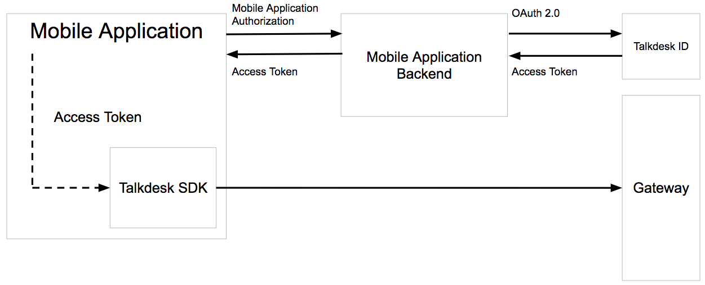
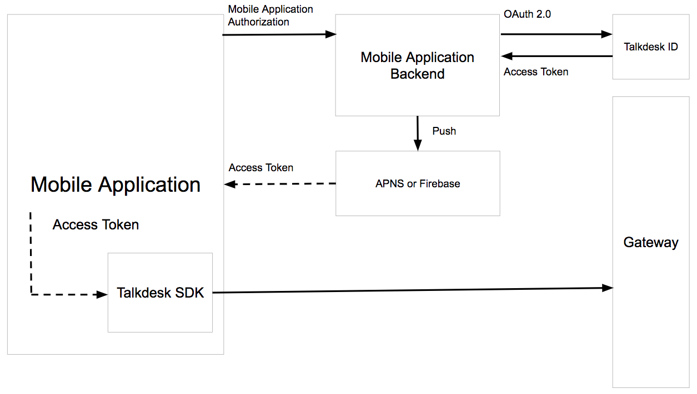

# Talkdesk SDK Android Integration Example

This repository contains a simple Android project that integrates with Talkdesk SDK in order to run an interaction. It implements the application-specific part of the [authorization mechanism](http://mobile-dev.talkdeskapp.com/android/docs/release/0.2.0/tutorials/tutorial.html#Authorization) of the SDK and can be used with the [Talkdesk Mobile SDK Customer Authentication Service sample](https://github.com/Talkdesk/mobile-sdk-customer-ruby-authentication-service-example).

## How to run
This sample app is designed to work with the [Talkdesk Mobile SDK Customer Authentication Service sample](https://github.com/Talkdesk/mobile-sdk-customer-ruby-authentication-service-example).
It's recommended to configure the authentication server first in order to have a better understanding of the properties that 
should be provided to have the sample Android application running.

In order to run this sample the following properties should be provided through the **gradle.properties** file:
* **API_HOSTNAME** - Reference authentication server host name;
* **API_APP_ID** - Application id which helps to identify your application on the server side, in case you have multiple applications;
* **API_AUTH_USERNAME** - Basic HTTP authentication username to prevent unwanted calls to the reference authentication server;
* **API_AUTH_PASSWORD** - Basic HTTP authentication password to prevent unwanted calls to the reference authentication server.
The Android Talkdesk SDK needs to authenticate with Talkdesk via an external service. This would typically be hosted on the mobile app 
backend or other customer-maintained server.

After that you are able to press the IDE's **Run button** to start the sample.

## How to configure an intention
To change the intention which you want to test it's necessary to change the `INTENTION_NAME` constant value which is located  in the `ExampleFragment.java` class.

You also can pass some additional configurations - for example, interaction reopen or autofill data - when you open the Interaction Channel.
For more information check the [SDK documentation](http://mobile-dev.talkdeskapp.com/android/index.html).

## Authentication diagrams
In the following diagram you can see how the authentication is performed and which components are involved.

For a Production-grade application we recommend the more sophisticated but more secure implementation with push notifications.

